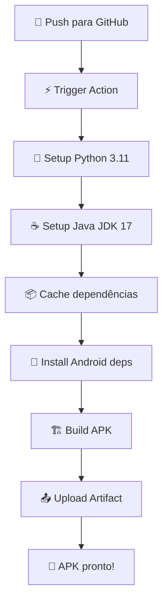

# 🚀 TerlineT Android - Build Automático com GitHub Actions

## 📋 Como Usar

### 1. 📤 Enviar código para GitHub

```bash
# Inicializar repositório Git (se ainda não foi feito)
git init

# Adicionar todos os arquivos
git add .

# Fazer commit
git commit -m "🚀 TerlineT Android - Código inicial"

# Adicionar repositório remoto (substitua pela sua URL)
git remote add origin https://github.com/SEU_USUARIO/TerlineT_Kivy.git

# Enviar para GitHub
git push -u origin main
```

### 2. ⚡ Executar Build Automático

**Opção A: Automático (quando fizer push)**

- O build inicia automaticamente quando você faz push para `main` ou `master`

**Opção B: Manual**

1. Vá para seu repositório no GitHub
2. Clique em **Actions**
3. Selecione **Build TerlineT Android APK**
4. Clique em **Run workflow**
5. Clique em **Run workflow** novamente

### 3. 📱 Baixar APK

Após 30-60 minutos:

1. **Via Artifacts:**
    - Vá para **Actions** → **Build concluído**
    - Baixe `terlinet-debug-apk`
    - Extraia o arquivo ZIP

2. **Via Releases (automático):**
    - Vá para **Releases** no seu repositório
    - Baixe o APK da versão mais recente

## ⏰ Tempo Estimado

| Etapa | Tempo |
|-------|-------|
| Configuração inicial | 5-10 min |
| Build primeira vez | 45-60 min |
| Builds subsequentes | 20-30 min (cache) |

## 🔍 Monitoramento

Durante o build, você pode:

1. **Ver progresso em tempo real:**
    - Actions → Build em andamento → Ver logs

2. **Receber notificações:**
    - GitHub envia email quando o build termina

3. **Verificar status:**
    - ✅ Verde = Sucesso
    - ❌ Vermelho = Erro
    - 🟡 Amarelo = Em progresso

## 📊 O que o Build faz



## 🐛 Solução de Problemas

### Build falhou?

1. **Verificar logs:**
    - Actions → Build com erro → Ver detalhes

2. **Erros comuns:**
    - **Dependência faltando:** Adicionada automaticamente
    - **Timeout:** Build muito longo (limite 6h)
    - **Espaço em disco:** Limpeza automática configurada

3. **Re-executar build:**
    - Actions → Build falhado → Re-run jobs

### APK não funciona?

1. **Verificar arquitetura:**
    - APK é para ARM64 (dispositivos modernos)
    - Para ARM32: modificar `buildozer.spec`

2. **Modelo GGUF:**
    - Copiar para `/storage/emulated/0/TerlineT/modelo/`
    - App funciona em modo simulado sem o modelo

## 🔧 Customização

### Modificar configuração:

Edite `.github/workflows/build-android.yml`:

```yaml
# Para build de release:
buildozer android release

# Para múltiplas arquiteturas:
android.archs = armeabi-v7a,arm64-v8a
```

### Adicionar secrets:

Para signing do APK:

1. Settings → Secrets → New repository secret
2. Adicionar keystore como secret
3. Modificar workflow para usar

## 📱 Instalação no Android

### Método 1: Download direto

1. Baixar APK do GitHub
2. Transferir para Android
3. Instalar (habilitar "Fontes desconhecidas")

### Método 2: Via ADB

```bash
# Baixar APK localmente
# Conectar Android via USB
adb install terlinet-debug.apk
```

## 🎯 Vantagens do GitHub Actions

✅ **Gratuito** para repositórios públicos  
✅ **Build limpo** sempre  
✅ **Cache inteligente** acelera builds  
✅ **Logs detalhados** para debug  
✅ **Artifacts automáticos**  
✅ **Releases automáticos**  
✅ **Sem setup local** necessário

## 🚀 Próximos Passos

1. **Push do código** para GitHub
2. **Executar primeiro build** (pode demorar)
3. **Baixar e testar APK**
4. **Copiar modelo GGUF** para Android
5. **Usar app normalmente**

---

**🎉 Seu TerlineT Android será buildado automaticamente na nuvem!** ☁️📱